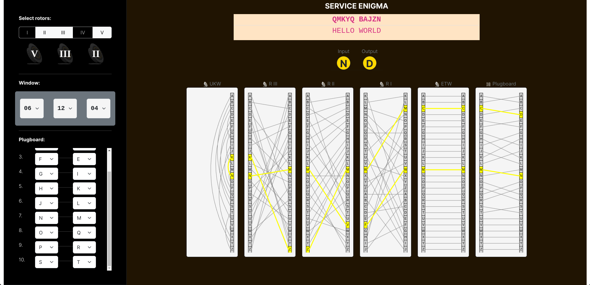

# Enigma I Simulator

This project simulates the Enigma I machine, also known as the Service Enigma, used by Germany during World War II. I hope this project can provide a better understanding of how the Enigma machine works. The Enigma machine is one of the most famous cryptographic devices in history, and its use had a significant impact on the course of the war.


## Description of the Enigma Machine

The Enigma machine was an electro-mechanical rotor machine used for encryption and decryption of secret messages. It utilized a combination of rotating disks (rotors) and a plugboard to create a complex cipher. The key components of the Enigma machine include:

- **Rotors**: Each rotor has a specific wiring that connects each letter to another letter, effectively scrambling the input. The machine typically uses multiple rotors, and their positions can be adjusted to change the encryption scheme.

- **Reflector**: The reflector redirects the electrical current back through the rotors, providing a symmetric encryption process.

- **Plugboard**: This component allows for additional scrambling by swapping pairs of letters before and after the signal passes through the rotors.

The combination of these elements made the Enigma machine highly secure for its time, leading to the perception that the messages were virtually unbreakable. However, the efforts of Allied codebreakers eventually led to the development of techniques that cracked the Enigma code, significantly aiding the Allied victory in World War II.

## Features

- **Rotor Selection**: 
  - Users can select from five rotors (I, II, III, IV, V), each with different wiring configurations.

- **Window Settings**: 
  - Allows users to set the initial position of the rotors, which affects the encryption outcome.

- **Plugboard Configuration**: 
  - Provides options to configure the plugboard connections, adding an extra layer of security to the encryption process.

- **Encryption Simulation**: 
  - Processes input and generates encrypted output, visually displaying the steps of encryption.

## Installation

1. **Clone this repository**:
   ```bash
   git clone https://github.com/username/enigma-simulator.git

2. **Navigate to the project directory**:
Copy code
    ```bash
    cd enigma-simulator

2. **Open the index.html file in your browser.**:

*Note: Ensure you are using a browser that supports HTML5 and JavaScript.*


## Usage
1. **Select rotors from the "Select rotors" section**:
- Click on the **Select rotors** to choose the desired rotor.

2. **Set window positions**:
- Enter the initial positions for each rotor (from 01 to 26).

3. **Configure plugboard connections**:
- Select letters to be swapped in the plugboard section.

4. **Enter text to be encrypted in the input section**:
- Each field must be filled in correctly.

5. **View the encryption result**:
- The encrypted output will be displayed in the output section.


## References

Video Explanation on How Enigma Works : [Jared Owed - How Enigma Works](https://www.youtube.com/watch?v=ybkkiGtJmkM).

Enigma Machine Configuration: [Crypto Museum - Enigma Wiring](https://www.cryptomuseum.com/crypto/enigma/wiring.htm).
